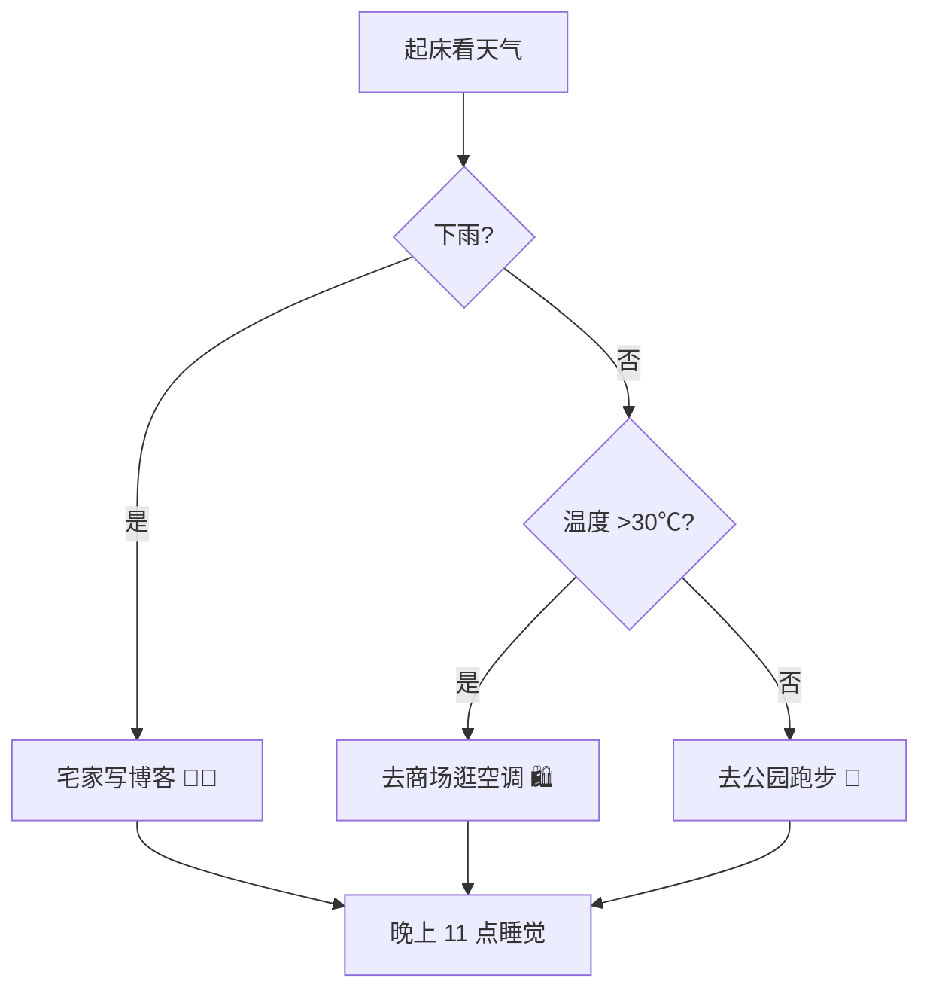
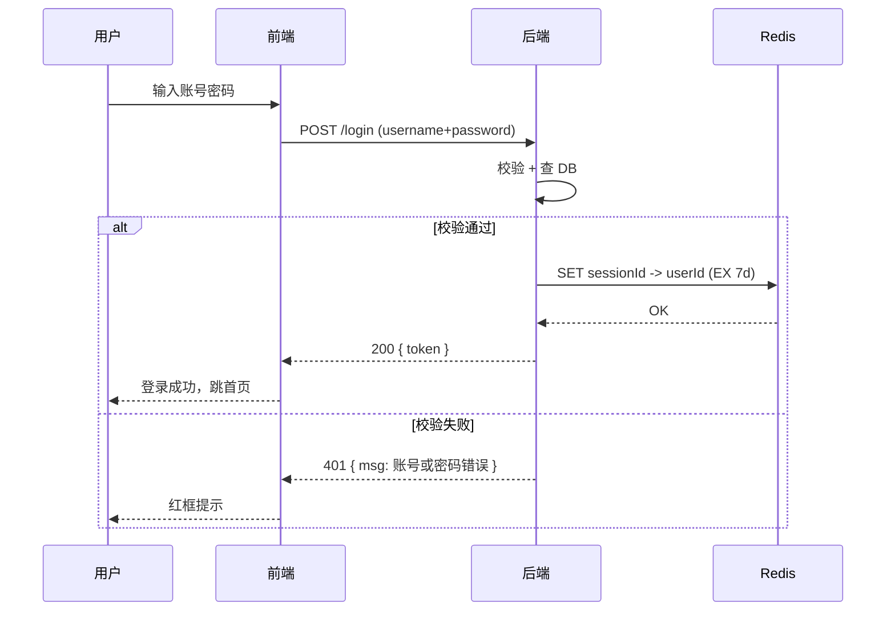
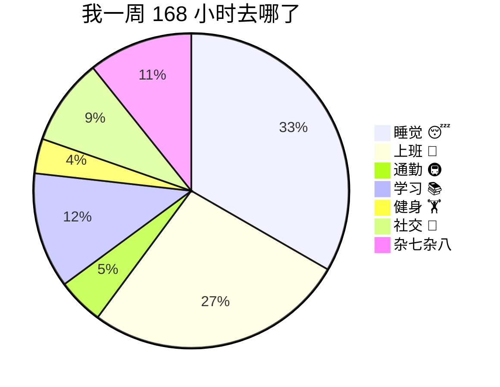

# 第 2 章 · 高级语法

> 如果你想让博客不仅有结构，还能**把数据讲清楚、把流程画出来、把公式写漂亮**，这一章的内容就是你的武器库。

---

## 1. 表格（必考！写博客必用）

### 1.1 基础表格

第一行是表头，第二行是分隔线（至少 3 个 `-`），剩下是数据行，列之间用 `|` 分开：

```md
| 技能 | 熟练度 | 想不想学 |
|---|---|---|
| HTML/CSS | ⭐⭐⭐⭐⭐ | 😄 已经很熟 |
| Vue | ⭐⭐⭐⭐ | 😃 继续深入 |
| 手写算法 | ⭐⭐ | 😅 刷题中 |
```

**效果：**

| 技能 | 熟练度 | 想不想学 |
|---|---|---|
| HTML/CSS | ⭐⭐⭐⭐⭐ | 😄 已经很熟 |
| Vue | ⭐⭐⭐⭐ | 😃 继续深入 |
| 手写算法 | ⭐⭐ | 😅 刷题中 |

> 💡 最外侧的 `|` 可加可不加（简洁派不加），但**一定要加分隔行 `|---|---|---|`**，少了这一行 Markdown 会把整个表格当成普通段落。

### 1.2 对齐方式（最重要的表格技巧）

在分隔行里用 `:` 控制对齐：

| 语法 | 效果 | 例子 |
|---|---|---|
| `:---` | 左对齐 | 默认 |
| `---:` | 右对齐 | 金额、数字（千分位才会整整齐齐）|
| `:---:` | 居中 | 标题、状态标签（✅/❌）|

**📊 实战案例：工资条**（钱必须右对齐，状态居中）：

```md
| 部门 | 员工 | 基本工资 | 绩效 | 合计 | 发放 |
|---|---|---:|---:|---:|:---:|
| 技术 | 张三 | 12,000 | 3,000 | 15,000 | ✅ |
| 技术 | 李四 | 15,000 | 5,000 | 20,000 | ✅ |
| 产品 | 王五 | 10,000 | 2,500 | 12,500 | 🕒 |
```

**效果：**

| 部门 | 员工 | 基本工资 | 绩效 | 合计 | 发放 |
|---|---|---:|---:|---:|:---:|
| 技术 | 张三 | 12,000 | 3,000 | 15,000 | ✅ |
| 技术 | 李四 | 15,000 | 5,000 | 20,000 | ✅ |
| 产品 | 王五 | 10,000 | 2,500 | 12,500 | 🕒 |

> 🤔 怎么记住？「冒号在哪边，就往哪边对齐」：`:`+`--` 就是**左边**对齐，`--`+`:` 就是**右边**对齐，两边都有就**居中**。

### 1.3 单元格里放复杂内容

表格里可以塞**行内粗斜/链接/行内代码/行内 emoji**，想换行就用 `<br>`：

```md
| 功能 | 语法速记 | 常见坑 |
|---|---|---|
| 粗体 | `**xx**` | 中文两边空一格才优雅 |
| 链接 | `[文本](url)` | `url` 里有空格/中文记得转码 |
| 代码块 | 三反引号 | 表格里塞不下长代码，<br>放表格外面加引用链接更佳 |
```

| 功能 | 语法速记 | 常见坑 |
|---|---|---|
| 粗体 | `**xx**` | 中文两边空一格才优雅 |
| 链接 | `[文本](url)` | `url` 里有空格/中文记得转码 |
| 代码块 | 三反引号 | 表格里塞不下长代码，<br>放表格外面加引用链接更佳 |

> ⚠️ 经验（ID 1139893）：**表格里嵌 `<tag>` 一定要写结束标签**，比如用 `<br>` 最好写成 `<br />`，如果插 `<span>`、`<details>` 这种必须闭合，否则 VitePress 可能报 "Element is missing end tag"。

---

## 2. 脚注（学术感拉满）

用 `[^1]` 在正文里插脚注标记，文末用 `[^1]: 脚注内容` 解释。适合引用资料来源、补充背景。

```md
Markdown 最初由 John Gruber 发明[^1]，后来派生出 CommonMark、GFM（GitHub Flavored Markdown）等标准。

我个人觉得 GFM 的几个扩展（表格、任务列表、围栏代码块）最实用[^2]。

---

[^1]: https://daringfireball.net/projects/markdown/ — 这是 Markdown 发明者的「官网」，风格非常 2004 年。
[^2]: 不过 GFM 里的 Alerts（:::note）各家支持程度不一，VitePress 用自定义容器（下一章讲）更稳。
```

渲染结果：正文中的 `[^1]` 会变成上标链接，点一下跳到文末；文末脚注末尾会带「↩」回到正文位置。

> 小技巧：脚注编号**不一定要是数字**，用单词也行，比如 `[^md-origin]`，阅读长文时更不容易迷路。

---

## 3. 数学公式（KaTeX）

VitePress 内置支持 KaTeX（需要开启 `markdown.math`，如未生效可在 `config.mts` 加 `markdown: { math: true }`）。

### 3.1 行内公式：一对 `$`

```md
质能方程是 $E = mc^2$，勾股定理是 $a^2 + b^2 = c^2$。
```

### 3.2 块级公式：一对 `$$`

```md
$$
\int_{a}^{b} f(x)\,dx = F(b) - F(a)
$$
```

### 3.3 📐 一套「机器学习面试常考三件套」模板（直接抄）

```md
### 1) 交叉熵损失函数

$$
L = -\frac{1}{N} \sum_{i=1}^{N} \sum_{j=1}^{C} y_{ij} \log \hat{y}_{ij}
$$

> 其中 $N$ 是样本数，$C$ 是类别数，$y$ 为 one-hot 真实标签，$\hat{y}$ 为模型输出的概率分布。

### 2) 梯度下降参数更新

$$
\theta_{t+1} = \theta_t - \eta \cdot \nabla_\theta J(\theta_t)
$$

### 3) 多头注意力

$$
\text{Attention}(Q,K,V) = \text{softmax}\!\left(\frac{QK^{\top}}{\sqrt{d_k}}\right)V
$$
```

> 💡 如果想知道某个符号怎么打（比如 $\alpha$ 是 `\alpha`，$\sum$ 是 `\sum`），直接 Google "latex symbols" 查一张速查表收藏就行，不用背。

---

## 4. Mermaid 流程图 & 图（强烈推荐）

VitePress 2.x 已**内置 Mermaid**。只要用三个反引号加 `mermaid` 语言名，就能画：

- 流程图 `graph`、时序图 `sequenceDiagram`、类图 `classDiagram`、状态图 `stateDiagram-v2`
- 饼图 `pie`、甘特图 `gantt`、脑图 `mindmap`、看板 `quadrantChart`
- 更多：https://mermaid.js.org/

### 4.1 流程图 · 一个「今天要不要出门」的决策树

````md

````

效果：一个从上到下的决策图，带 YES/NO 分支和最终汇点。

> **Mermaid 小抄（节点形状）**：
> - 矩形 `id[文本]`
> - 圆角矩形 `id(文本)`
> - 圆形 `id((文本))`
> - 菱形（判断）`id{文本}`
> - 平行四边形（输入输出）`id[/文本/]`
> - 箭头：`-->` 实线箭头、`-.->` 虚线箭头、`==>` 粗箭头

### 4.2 时序图 · 用户登录场景

````md

````

### 4.3 饼图 · 一周时间分配

````md

````

**🎨 建议**：Mermaid 语法细节不用背，**需要画图的时候打开这一章挑一种模板改文字就行**。写技术博客时，一张 Mermaid 流程图比三段文字更能讲清楚逻辑。

---

## 5. 直接写 HTML（应急兜底）

标准 Markdown 解决不了的，就直接写 HTML，浏览器原生支持。

### 5.1 颜色、字号、小字、上下标

```md
我是<span style="color: #e11d48; font-weight: 700;">红色粗体字</span>，
我是<small>小字号灰色说明文字</small>，我是<sup>上标</sup>和<sub>下标</sub>。
```

我是<span style="color: #e11d48; font-weight: 700;">红色粗体字</span>，
我是<small>小字号灰色说明文字</small>，我是<sup>上标</sup>和<sub>下标</sub>。

### 5.2 图片并排 + 等比分栏

```md
<div style="display:flex; gap:16px;">
  
  
</div>
```

> ⚠️ 几点注意：
> 1. **标签必须闭合**：`<div>...</div>`、`<br />`、``
> 2. HTML 块前后要空一行，和 Markdown 文本隔开，否则解析器会混淆
> 3. 避免在 HTML 里写 `script` / `iframe` 这些危险标签 —— 生产站点可能被 CSP 拦

### 5.3 折叠内容（原生 `<details>`）

::: tip 其实 VitePress 有更优雅的 `::: details` 容器（第三章讲）
但如果你要在**纯 Markdown 环境**（比如 GitHub README）也能用，`<details>` 是万能兜底：
:::

````md
<details>
<summary>👉 点我展开看彩蛋</summary>

恭喜你发现了隐藏内容！里面可以照常写 Markdown：

```js
console.log('surprise 🎁')
```

（空一行后关闭标签）
</details>
````

渲染是一个可点击的折叠条，前端面试题 + 答案这种排版最适合。

---

## 6. 🧪 本章综合实战：写一篇「2026 上半年总结」

下面这一整篇是 **1、2 章语法大混合**，复制到 md 文件里就能看到渲染效果，照着改改数字就是你的真实总结：

````md
# 2026 年上半年总结（1~6 月）

> 目标复盘 + 下半年计划。
> 数据驱动，不写空话。

## 🎯 核心目标完成度

| 目标 | 年初计划 | 实际完成 | 完成率 | 评价 |
|---|---|---|---:|:---:|
| 博客篇数 | 24 篇 | 18 篇 | 75% | 🟡 |
| 读书 | 6 本 | 5 本 | 83% | 🟢 |
| 体重（kg） | 65 | 67 | — | 🔴 超了 2kg |
| LeetCode 刷题 | 100 题 | 46 题 | 46% | 🔴 严重拖 |

## 📚 读过的书

1. **《把时间当作朋友》**[^1] — 重看了一遍，常读常新
2. **《系统设计面试》** — 做了 12 页手写笔记，强烈推荐
3. **《原则》** — 只看完前 5 章，*下半年抽空*
4. **《你不知道的 JS（中卷）》** — 做了 3 篇博客笔记
5. **《置身事内》** — 非技术，周末地铁读，刷新了对中国经济的认知[^2]

## 🏋️ 每月健身打卡（任务列表）

- [x] 1 月：12 次（刚过完年略水）
- [x] 2 月：16 次
- [x] 3 月：18 次（全年峰值）
- [x] 4 月：10 次（出差多）
- [x] 5 月：13 次
- [ ] 6 月：只去了 5 次，**下个月补上**

## 🧠 几个想通了的道理

> 种一棵树最好的时间是十年前，其次是现在。
>
> —— 这句话以前以为是鸡汤，**今年真正尝到「复利」甜头后才懂**。

---

## 下半年计划

### 目标：体重 -3kg + 刷题 100 + 博客 30

```js
const H1 = { posts: 18,  books: 5,  weight: 67, lc: 46  }
const H2 = { posts: 30,  books: 11, weight: 64, lc: 146 }
console.table({
  博客: `${H2.posts - H1.posts} 篇增量`,
  读书: `${H2.books - H1.books} 本增量`,
  体重: `${H1.weight - H2.weight}kg 下降`,
  力扣: `${H2.lc - H1.lc} 题增量`,
})
```

[^1]: 豆瓣链接：https://book.douban.com/subject/4240282/  — 评分 8.4
[^2]: 一句话概括：**政府不是一个"外生"的旁观者，它本身就是经济游戏里最重要的玩家之一。**
````

---

**👉 下一章**：[第 3 章 · VitePress 专属增强](./3-vitepress.md)，教你如何把「一篇 Markdown」升级成「一篇专业级 VitePress 文档」—— Frontmatter、提示框、代码行高亮、选项卡、团队页卡片，全是立刻能让博客颜值跃升的东西。
